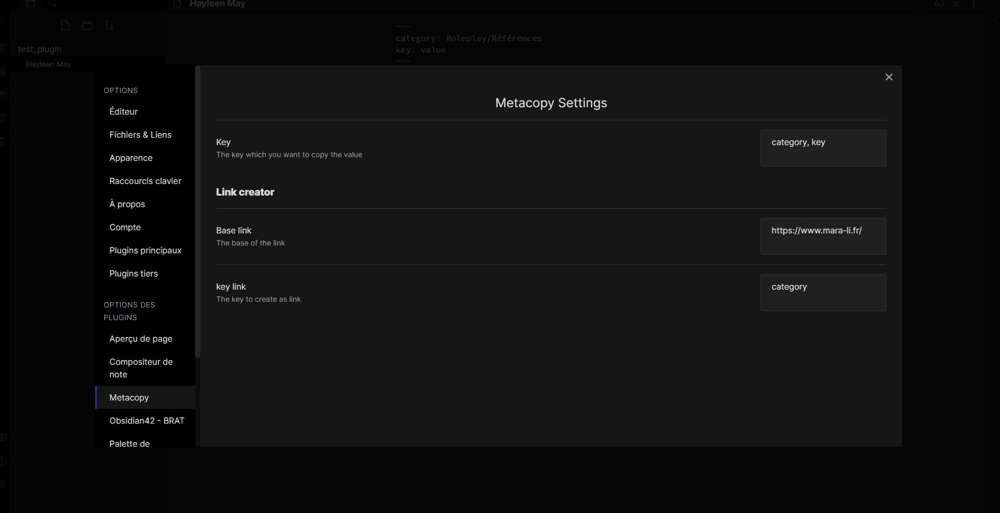
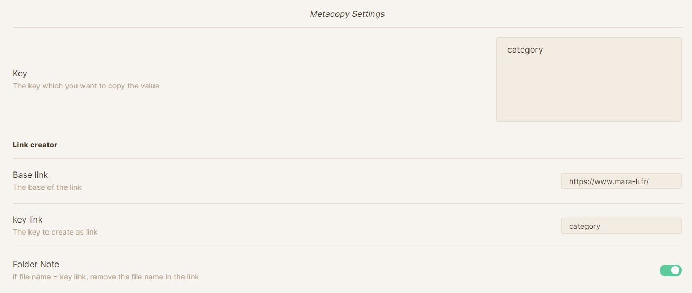
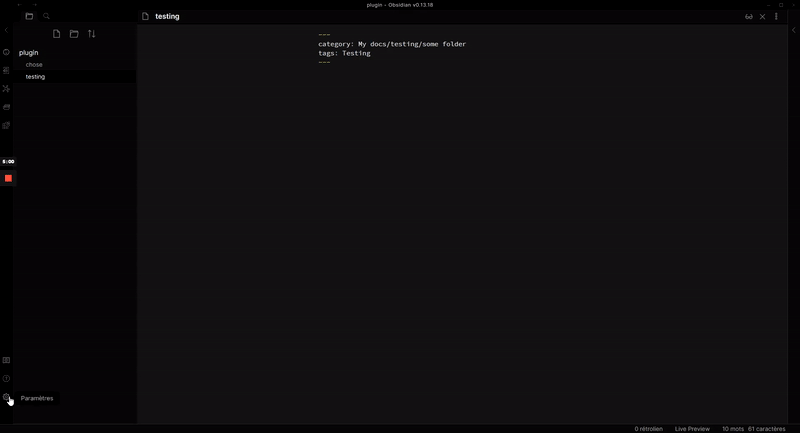

This plugin recommended being used
with [Obsidian To Mkdocs](https://github.com/Mara-Li/mkdocs_obsidian_publish).
# Obsidian — MetaCopy

The purpose of this plugin is to get quickly the value of a front matter key. You can set multiple value in settings, as : `key1, key2, key3, ...`

If the plugin found multiple key in the front matter :

1. The context takes the **first** value from the front matter.
2. The command creates a menu where you can choose the value you want.

The value added in your pasteboard, so you can paste it everywhere.

Yeah. That's it.

Here is the plugin in action :


# Links creator

## Base options

If you want to create a link to a page, you can use this plugin.

> ⚠️ This function only work if you have a frontmatter.

There are 3 possibles configuration :

- Creating link using a default folder
- Creating link using the base link **plus** the relative obsidian path
- Creating the link using a frontmatter key.

### Fixed folder

The resulted link will be `{your_base_link}/{default_folder}/{filename}/`.

> 💭 Folder note option is disabled with this option.

### Obsidian Path option

The resulted link will be : `{your_base_link}/{obsidian_path}/{filename}/`.

### Frontmatter

You can create a link using a front matter key.

1. The key must be both in `key` and in `key link`
2. You need to configure the `base link`

The link creator works as the main plugin : file menu will take the first value,
so if this value is the link key, it will create a link.

You can also set a `default value`, that will be a fallback in case of the
absence of a `category` key & value.



Furthermore, the editor menu will add an option to copy the link if it exists.

## Folder note support

You can enable the support of folder note (with the “folder name” behavior) to
create link without the file's name if it's the same of the last folder of the
link key.

> ️🗒️ Example : <u>Obsidian Path</u>
> - If you set as `default value` : `docs`
> - If your file is named `noteIndex` and their folder `myFolder`
> - The link will be `{your_base_link}/{obsidian_path}/docs/myFolder/`

> 🗒️ Example : <u>Frontmatter</u>
> - If you set `link_key: folder1/folder2/noteIndex`
> - If your file is named `noteIndex`
> - The result link will be : `{base_link}/folder1/folder2/noteIndex/`

> ⚠️ This option is not compatible with the `Fixed Folder` option.

## Disable menu

You can disable the menu using a front matter key. There are two behaviors :

1. Settings enabled :
   The key must be present **and** set to **true** to **enable** the menu.
2. Setting is disabled:
   The default behavior.
   The key must be absent **or** set to **false** to **disable** the menu.

Regardless of the option, the command modal continue to work.

# Obsidian Mkdocs

Furthermore, the plugin recommended being used
with [Obsidian To Mkdocs](https://github.com/Mara-Li/mkdocs_obsidian_publish) to
copy link without editing the source file.

To use Obsidian2mkdocs with Metacopy, here is the configuration :



This template allows copying a link, as you will do with Notion or Google Docs (
for example).

The file template will be :
```yaml
title: 
category: something/like/that
share: true
```

[Here is a demo](https://www.loom.com/share/88c64da2ba194e219578d5911fb8e08d) : 
[](https://www.loom.com/share/88c64da2ba194e219578d5911fb8e08d)
---

The plugin is inspired by [Copy Publish URL](https://github.com/kometenstaub/copy-publish-url) but for all link (instead of only publish).


# 🖥️ Development

- Fork / clone the repository
- `npm install`
- `npm run dev` (or `npm run build`)

# Installation

1. You can use [BRAT](https://github.com/TfTHacker/obsidian42-brat) with the link to the repository.
2. You can use the community plugin registry.
3. Likewise, you can manually install the plugin using [release](https://github.com/Mara-Li/obsidian-metacopy/releases) and unzip obsidian-metacopy-x.x.xx.zip in your `.obsidian/plugins` folder.
